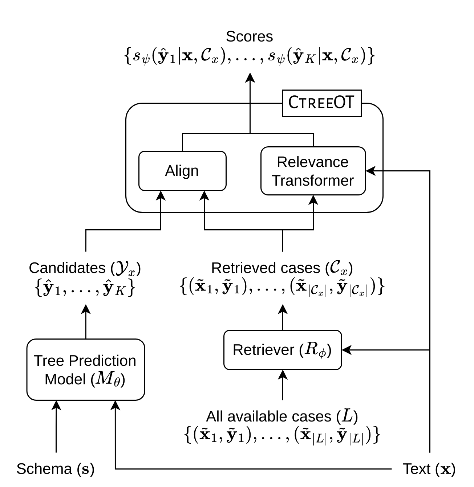
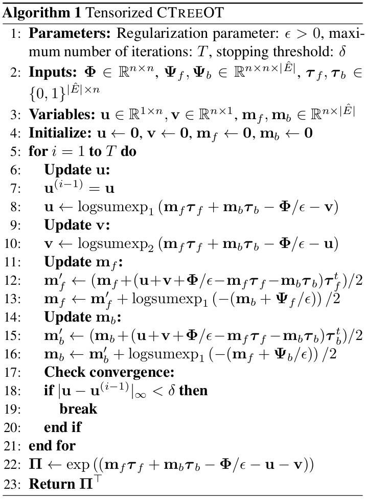

# Conditional Tree Matching for Inference-Time Adaptation of Tree Prediction Models

Official code for our paper: ['Conditional Tree Matching for Inference-Time Adaptation of Tree Prediction Models'](https://proceedings.mlr.press/v202/varma23a.html) presented at [ICML 2023](https://icml.cc/).

## Overall Approach and Alignment Algorithm

<p align="center">
  
  
</p>

## Setup
1. Create a virtual environment and activate it
2. Install PyTorch 1.11.0 for your machine and CUDA version from [here](https://pytorch.org/get-started/previous-versions/#v1110)
3. Install `tqdm` and `matplotlib`

## Running the Code
- `ctreeot.py`: implementation of the CTreeOT algorithm
- `sinkhorn.py`: implementation of the [Sinkhorn algorithm](https://papers.nips.cc/paper_files/paper/2013/file/af21d0c97db2e27e13572cbf59eb343d-Paper.pdf)
- `main.py`: runs the experiments comparing the run time and constraint violations of Sinkhorn and CTreeOT on various tree sizes. See `run.sh` for more details on how to run `main.py`.
- `plot.py`: generates the run time and constraint violation plots comparing Sinkhorn and CTreeOT in `./plots`. Note that the current plots present inside `./plots` were obtained by running the experiments on Google Colab with an NVIDIA T4 GPU, unlike the ones reported in the paper which were on an NVIDIA RTX A6000 GPU. 

## Citation
If you found our work useful, please cite us as:
```bibtex

@InProceedings{pmlr-v202-varma23a,
  title = 	 {Conditional Tree Matching for Inference-Time Adaptation of Tree Prediction Models},
  author =       {Varma, Harshit and Awasthi, Abhijeet and Sarawagi, Sunita},
  booktitle = 	 {Proceedings of the 40th International Conference on Machine Learning},
  pages = 	 {34908--34923},
  year = 	 {2023},
  editor = 	 {Krause, Andreas and Brunskill, Emma and Cho, Kyunghyun and Engelhardt, Barbara and Sabato, Sivan and Scarlett, Jonathan},
  volume = 	 {202},
  series = 	 {Proceedings of Machine Learning Research},
  month = 	 {23--29 Jul},
  publisher =    {PMLR},
  pdf = 	 {https://proceedings.mlr.press/v202/varma23a/varma23a.pdf},
  url = 	 {https://proceedings.mlr.press/v202/varma23a.html}
}
```
