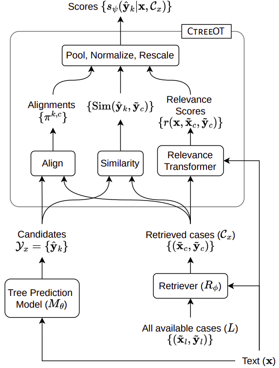

# Conditional Tree Matching for Inference-Time Adaptation of Tree Prediction Models

Official code for our paper: ['Conditional Tree Matching for Inference-Time Adaptation of Tree Prediction Models'](https://proceedings.mlr.press/v202/varma23a.html); to be presented at [ICML 2023](https://icml.cc/).

*`Code will be uploaded soon`*

## Overall Approach and Alignment Algorithm

<p align="center">
  
  
</p>

## Setup
1. Create a virtual environment and activate it
2. Install PyTorch 1.11.0 for your machine and CUDA version from [here](https://pytorch.org/get-started/previous-versions/#v1110)
3. Run `pip install -r requirements.txt`

## Directory Structure

## Running the Code

## Citation
If you found our work useful, please cite us as:
```bibtex

@InProceedings{pmlr-v202-varma23a,
  title = 	 {Conditional Tree Matching for Inference-Time Adaptation of Tree Prediction Models},
  author =       {Varma, Harshit and Awasthi, Abhijeet and Sarawagi, Sunita},
  booktitle = 	 {Proceedings of the 40th International Conference on Machine Learning},
  pages = 	 {34908--34923},
  year = 	 {2023},
  editor = 	 {Krause, Andreas and Brunskill, Emma and Cho, Kyunghyun and Engelhardt, Barbara and Sabato, Sivan and Scarlett, Jonathan},
  volume = 	 {202},
  series = 	 {Proceedings of Machine Learning Research},
  month = 	 {23--29 Jul},
  publisher =    {PMLR},
  pdf = 	 {https://proceedings.mlr.press/v202/varma23a/varma23a.pdf},
  url = 	 {https://proceedings.mlr.press/v202/varma23a.html}
}
```
